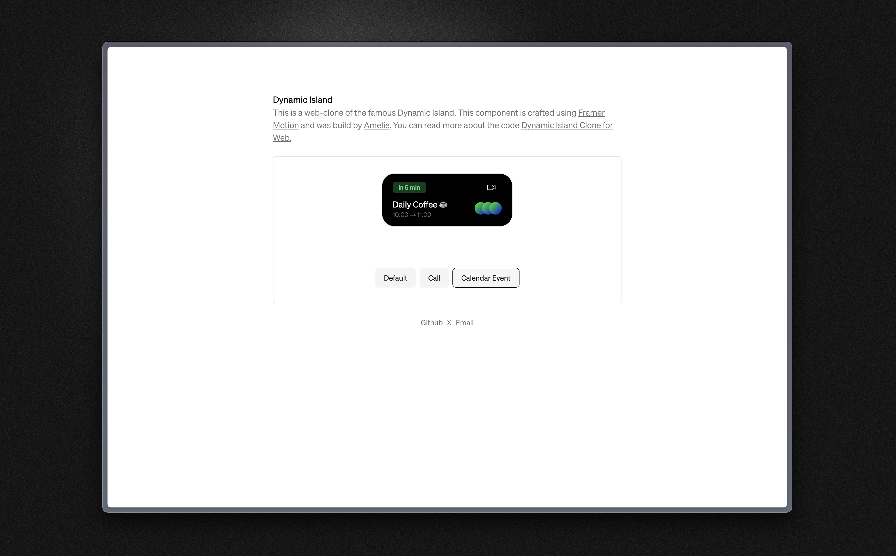

<div style="text-align: center; width: 100%;">
  <p>Feel free to contact me via:</p>
  <div style="display: flex; align-items: center; justify-content: center; gap: .5rem;">
    <a style="text-decoration: underline" href="https://twitter.com/amelieschltr">𝚡 X</a>
    -
    <a style="text-decoration: underline" href="https://read.cv/amelieschltr">📑 Read.cv</a>
    -
    <a style="text-decoration: underline" href="mailto:as@amelieschlueter.com">📧 E-Mail</a>
  </div>
</div>

## Dynamic Island Webclone

I constantly work on enhancing my web animation skills. I practiced Framer Motion by recreating the Dynamic Island on the web with Next.js, Framer Motion, and Tailwind CSS. Explore the component and learn more about it on my [personal site](https://amelieschlueter.com).

### How to use

---

1. Clone the Repo
2. Install the dependecies.

```
pnpm install
```

3. Run the Dev Server

```
pnpm run dev
```

### Reach out 📢

If you have any questions feel free to reach out to me on [X](https://twitter.com/amelieschltr), [Read.cv](https://read.cv/amelieschltr) or via [E-Mail](mailto:as@amelieschlueter.com). I'am always open to connect to new people or just have a chat.
